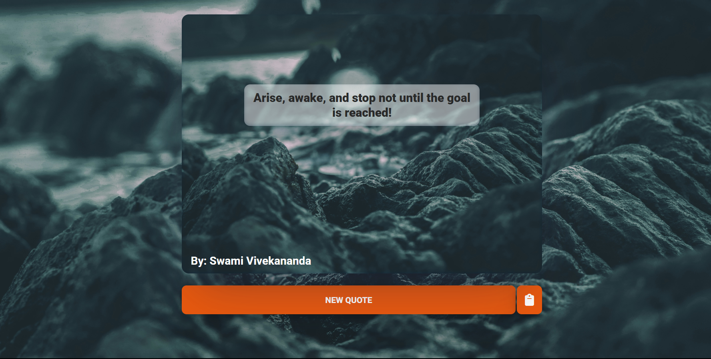
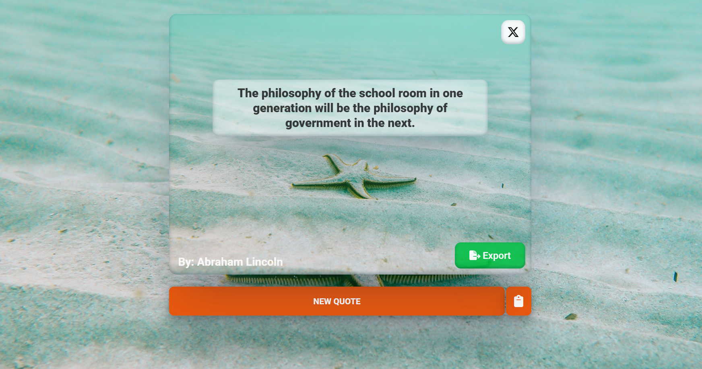

# QuoteZen

## Overview

**QuoteZen** is a simple web application that fetches and displays a random quote from an API. The app provides interactive features to refresh quotes, copy them to the clipboard, share on X, refresh background-image and more.

## Application Features

- **Random Quote Fetching:** Retrieves a random quote along with the author from an API.
- **New Quote Button:** Click the button to fetch another quote.
- **Copy to Clipboard:** Easily copy the quote to your clipboard.
- **Share on X:** Share your favorite quote directly on X.
- **Bonus Features:**
  - Set a random background image behind the quote.
  - Export the quote as an image to save on your computer.

## Screenshots




## Deployment

You can view the live application at: [Deployment Link](https://quote-zen.vercel.app/)

## How to Run Locally

1. Clone the repository:
   ```bash 
   git clone https://github.com/sahemant12/QuoteZen.git
